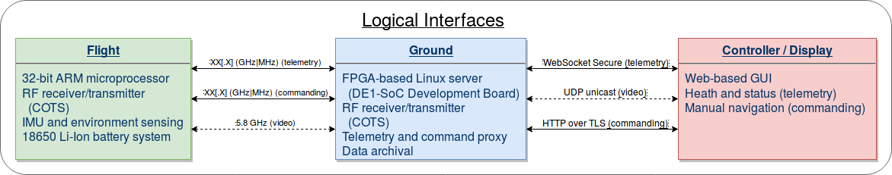

Fault-Tolerant Quadcopter
=========================

A senior design project (Fall 2018) by Mayank Katwal, Vaughn Kottler and
Cooper Green. We are undergraduate Computer Engineering and Computer Sciences
students at the University of Wisconsin-Madison.

Overview
--------

Attempting to build and fly a quadcopter is an exercise that reveals some of
the challenges faced by engineers working in aerospace.

Quadcopter kits, components, reference designs and instructional content
currently exist in high volumes from hobbyist to enthusiast quality and price.
We aim to take advantage of this ecosystem so we can choose the specific
problems and design aspects we want to understand and build solutions for.

In our case, we want to focus on an end-to-end
(ground controller / display + ground station + vehicle) avionics and
software system.

Block Diagram
-------------

Goals and Scope
---------------

The high-level goal is to fly a quadcopter with as much custom
hardware (electronic) and software/firmware in the loop as possible.

The project is designed for three significant bodies of work, which are:

#. A ground control interface and web-based telemetry display

   - Sends commands to the vehicle for manual control and navigation
   - Visualizes telemetry data for health and status at a glance
#. A ground station that communicates directly with the vehicle

   - Hosts telemetry, forwards commands
   - Stores data for archival and post-flight viewing
   - Hosts the telemetry display application
#. The vehicle itself

   - Accepts commands from the ground, sends telemetry back to the ground
   - Maintains a holding pattern, or attempts a soft landing if ground
     communication is lost

Table of Contents
-----------------

.. toctree::

   project_management
   flight
   ground
   display
