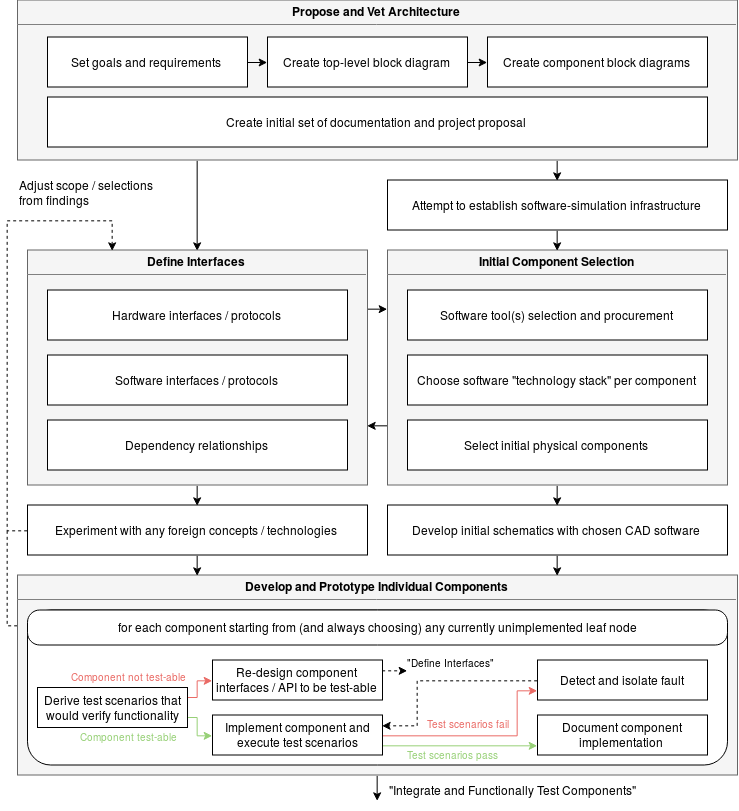
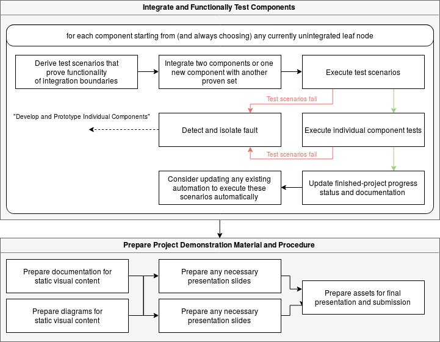

Project Management
==================

This page discusses our approach to managing time and
resouces to hopefully accomplish our goals by the end
of the semester.

*"A problem well stated is a problem half solved." - Charles Kettering*

Abstract
--------

Most projects require periods of learning. In some cases,
learning objectives can be identified early on. One good
example of such a learning objective in this context is
the wireless communication between the vehicle and ground
station.

We don't have prior experience with this type of radio
frequency communication. We know some amount of research
and testing will be required to make an informed decision
on component selection for this feature of the system.

Despite knowing this, it is still difficult to estimate
the effort it will take to bring this part of the system
online. This is generally true for "known unknown" aspects
of a project.

Experienced engineers are often able to take a top-level
"known unknown" and unpack it into a more bite-sized set
of "knowns" and "known unknowns" to determine initial
steps in approaching the problem and making forward progress.

This is important because "known unknowns" typically have
"unknown unknown" components that can only be revealed by
reaching certain milestones.

Plan of Attack
--------------

*"If I had an hour to solve a problem I'd spend 55 minutes thinking about
the problem and 5 minutes thinking about solutions." - Albert Einstein*

We believe there is significant value in planning out the body of work before
even prototyping and experimenting. The following diagrams attempt to capture
how we intend to move into implementation and completion of this project.

Initial Development and Prototyping
***********************************

How we plan to approach the initial stages of the project:

Final Stages
************

How we plan to approach integration and final result preparation:

